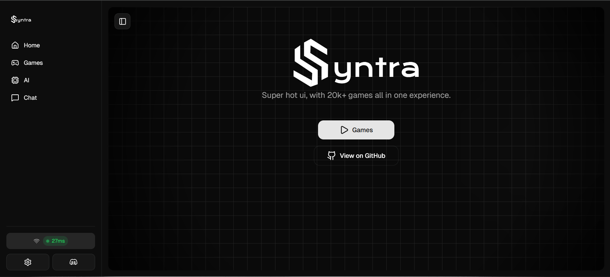

# Syntra Lite

**Syntra Lite** is a fully self-contained unblocked gaming platform offering a seamless, single-file experience. It delivers fast access to a catalog of more than six hundred games, an integrated real-time chat system, built-in AI utilities, and robust tab cloaking. Everything runs in the browser without external setup.

---

Demo:
Download index.html open it and see it urself, or paste this data ur ion the searchbar and click the button
`data:text/html;base64,PCFET0NUWVBFIGh0bWw+DQo8aHRtbCBsYW5nPSJlbiI+DQo8aGVhZD4NCiAgPG1ldGEgY2hhcnNldD0iVVRGLTgiPg0KICA8bWV0YSBuYW1lPSJ2aWV3cG9ydCIgY29udGVudD0id2lkdGg9ZGV2aWNlLXdpZHRoLCBpbml0aWFsLXNjYWxlPTEuMCI+DQogIDx0aXRsZT5NYXRoIEhvbWV3b3JrPC90aXRsZT4NCiAgPGxpbmsgcmVsPSJwcmVjb25uZWN0IiBocmVmPSJodHRwczovL2ZvbnRzLmdvb2dsZWFwaXMuY29tIj4NCiAgPGxpbmsgcmVsPSJwcmVjb25uZWN0IiBocmVmPSJodHRwczovL2ZvbnRzLmdzdGF0aWMuY29tIiBjcm9zc29yaWdpbj4NCiAgPGxpbmsgaHJlZj0iaHR0cHM6Ly9mb250cy5nb29nbGVhcGlzLmNvbS9jc3MyP2ZhbWlseT1HZWlzdDp3Z2h0QDUwMCZkaXNwbGF5PXN3YXAiIHJlbD0ic3R5bGVzaGVldCI+DQogIDxzdHlsZT4NCiAgICA6cm9vdCB7DQogICAgICAtLXByaW1hcnk6IG9rbGNoKDAuMjA1IDAgMCk7DQogICAgICAtLXByaW1hcnktZm9yZWdyb3VuZDogb2tsY2goMC45ODUgMCAwKTsNCiAgICAgIC0tYmFja2dyb3VuZDogb2tsY2goMSAwIDApOw0KICAgIH0NCg0KICAgIEBtZWRpYSAocHJlZmVycy1jb2xvci1zY2hlbWU6IGRhcmspIHsNCiAgICAgIDpyb290IHsNCiAgICAgICAgLS1wcmltYXJ5OiBva2xjaCgwLjkyMiAwIDApOw0KICAgICAgICAtLXByaW1hcnktZm9yZWdyb3VuZDogIzBlMGUwZTsNCiAgICAgICAgLS1iYWNrZ3JvdW5kOiBva2xjaCgwLjE0NSAwIDApOw0KICAgICAgfQ0KICAgIH0NCg0KICAgICogew0KICAgICAgbWFyZ2luOiAwOw0KICAgICAgcGFkZGluZzogMDsNCiAgICAgIGJveC1zaXppbmc6IGJvcmRlci1ib3g7DQogICAgfQ0KDQogICAgYm9keSB7DQogICAgICBmb250LWZhbWlseTogJ0dlaXN0Jywgc2Fucy1zZXJpZjsNCiAgICAgIGJhY2tncm91bmQ6IHZhcigtLWJhY2tncm91bmQpOw0KICAgICAgZGlzcGxheTogZmxleDsNCiAgICAgIGp1c3RpZnktY29udGVudDogY2VudGVyOw0KICAgICAgYWxpZ24taXRlbXM6IGNlbnRlcjsNCiAgICAgIG1pbi1oZWlnaHQ6IDEwMHZoOw0KICAgICAgcGFkZGluZzogMXJlbTsNCiAgICB9DQoNCiAgICBidXR0b24gew0KICAgICAgd2lkdGg6IDEwMCU7DQogICAgICBtYXgtd2lkdGg6IDUwMHB4Ow0KICAgICAgcGFkZGluZzogNHJlbSAycmVtOw0KICAgICAgZm9udC1mYW1pbHk6IGluaGVyaXQ7DQogICAgICBmb250LXNpemU6IGNsYW1wKDIuNXJlbSwgOHZ3LCA0cmVtKTsNCiAgICAgIGZvbnQtd2VpZ2h0OiA1MDA7DQogICAgICBjb2xvcjogdmFyKC0tcHJpbWFyeS1mb3JlZ3JvdW5kKTsNCiAgICAgIGJhY2tncm91bmQ6IHZhcigtLXByaW1hcnkpOw0KICAgICAgYm9yZGVyOiBub25lOw0KICAgICAgYm9yZGVyLXJhZGl1czogMC44NzVyZW07DQogICAgICBjdXJzb3I6IHBvaW50ZXI7DQogICAgICB0cmFuc2l0aW9uOiB0cmFuc2Zvcm0gMC4ycywgYm94LXNoYWRvdyAwLjJzOw0KICAgIH0NCg0KICAgIGJ1dHRvbjpob3ZlciB7DQogICAgICB0cmFuc2Zvcm06IHNjYWxlKDEuMDIpOw0KICAgIH0NCg0KICAgIGJ1dHRvbjphY3RpdmUgew0KICAgICAgdHJhbnNmb3JtOiBzY2FsZSgwLjk4KTsNCiAgICB9DQogIDwvc3R5bGU+DQo8L2hlYWQ+DQo8Ym9keT4NCiAgPGJ1dHRvbiBvbmNsaWNrPSJmZXRjaCgnaHR0cHM6Ly9jZG4uanNkZWxpdnIubmV0L2doL291dGJyb3dzZWQvc3ludHJhbGl0ZTIxa0BtYWluL2luZGV4Lmh0bWwnKQ0KICAgIC50aGVuKHIgPT4gci50ZXh0KCkpDQogICAgLnRoZW4odCA9PiB7DQogICAgICBkb2N1bWVudC5vcGVuKCk7DQogICAgICBkb2N1bWVudC53cml0ZSh0KTsNCiAgICAgIGRvY3VtZW50LmNsb3NlKCk7DQogICAgfSkNCiAgICAuY2F0Y2goZSA9PiBjb25zb2xlLmVycm9yKGUpKSI+DQogICAgTWF0aCBIb21ld29yaw0KICA8L2J1dHRvbj4NCjwvYm9keT4NCjwvaHRtbD4=`

---

## Features

* Single-file deployment for maximum portability
* Library of 600+ curated unblocked games
* Real-time chat embedded directly into the interface
* Built-in ai assistant for content generation and support
* Browser cloaking for platforms such as Google, YouTube, ClassLink, and others
* Multiple cloaking strategies including `about:blank` and `blob:` url injection
* Lightweight structure optimized for speed
* Continuous feature expansion

---

## Live Preview

---

## Capabilities

### Game Library

A comprehensive catalog of browser-ready titles accessible without installation.

### Communication

A live chat module enabling conversation inside the environment.

### Cloaking

Dynamic tab masking with support for common educational platforms to reduce detection.

### ai Assistance

On-page intelligent tools designed to enhance navigation and productivity.

---

## Technical Advantages

* Self-contained single asset for quick deployment
* Works on modern browsers including Chromium-based and Firefox derivatives
* Supports private or offline hosting environments

---

## License

GPL v2 © 2025 OutBrowsed
<https://www.gnu.org/licenses/old-licenses/gpl-2.0.en.html>
